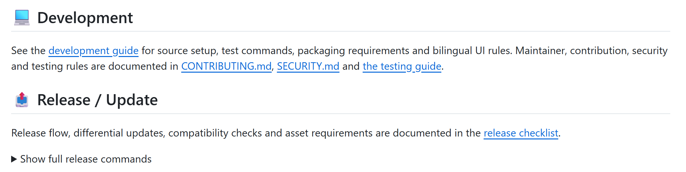

<p align='center'>

</p>

<h1 align="center">TikTokShop Creator Scraper</h1>

<p align="center">Open-source desktop app for TikTok Shop sellers to discover, analyze and export affiliate creator data — GMV, followers, engagement, bio, email, MCN info — to CSV/Excel.</p>

<p align="center">
  <a href="https://github.com/1Milkdeliver/tiktok-shop-creator-scraper/stargazers"></a>
  <a href="https://github.com/1Milkdeliver/tiktok-shop-creator-scraper/network/members"></a>
  <a href="https://github.com/1Milkdeliver/tiktok-shop-creator-scraper/blob/main/LICENSE"></a>
  <a href="https://github.com/1Milkdeliver/tiktok-shop-creator-scraper/releases/latest"></a>
</p>

<div align="center">
  <a href="./README.zh-CN.md">中文</a> / <a href="./README.md">English</a>
</div>

---

## 📑 Table of Contents

- [🚀 Introduction](#-introduction)
- [🎯 Who It's For](#-who-its-for)
- [✨ Features](#-features)
- [📊 Data You Can Collect](#-data-you-can-collect)
- [📦 Install](#-install)
- [🚀 Quick Start](#-quick-start)
- [❓ FAQ](#-faq)
- [💻 Development](#-development)
- [📤 Release / Update](#-release--update)
- [📄 License](#-license)

---

## English usage example

Enter `wireless earbuds`, choose `US`, select **Creator Search**, and start the task. The app stores creator ID, handle, region, followers, Shop performance and available contact fields locally, then exports selected columns to CSV or Excel.



## 🚀 Introduction

**TikTokShop Creator Scraper** is an open-source desktop application built for **TikTok Shop sellers** to:

- Scrape creator data from the TikTok Shop Affiliate (联盟) marketplace — search by keywords, or import creator IDs / @handles / TikTok links directly
- **Local creator library (SQLite)**: scraped creators are stored, deduplicated, browsable, sortable and filterable — builds up as you scrape
- **Activity classification**: creators are automatically tagged active / inactive / unknown with explainable signals (last publish, growth, GMV trend)
- Analyze creator performance (GMV, sales, engagement, follower demographics, PPS score)
- Extract bio, collaboration email and MCN agency; optionally authorize your Partner Center session to enrich existing records with WhatsApp, LINE and other contacts provided by the platform
- Export everything to **CSV / Excel** with selectable fields — headers follow the UI language (CN/EN one-click switch)
- Output history with one-click **Continue / Refresh / Open / Delete**, resume from breakpoints, automatic deduplication

> Open-source · GPL-3.0 · Windows desktop app · Multi-account concurrent scraping · Auto-update

## 🎯 Who It's For

- **TikTok Shop Sellers** — find creators to collaborate with, screen potential partners
- **Affiliate Ops / Business Dev** — batch-organize creator info, reach out for collaboration
- **Product Selection Teams** — analyze creator data by category

## ✨ Features

| Feature | Description |
|---|---|
| 🎨 Workspaces | Sidebar: **Overview / Task Center / Creator Library / Export Center**, bilingual |
| 💾 Creator library | SQLite storage: auto-dedupe, browse / sort / filter / refresh |
| 🔍 Creator scraping | Batch keyword search, or import ID / @handle / TikTok links directly |
| 🌍 Multi-region | Choose US / UK / Southeast Asia / LATAM shop regions |
| 📧 Contact info | Bio, email, MCN; optional Partner Center authorization for available WhatsApp, LINE, Zalo, Viber, Facebook and other contacts |
| 📁 Export | CSV / Excel with customizable fields; headers follow UI language |
| 🔁 Resume history | One-click **Continue** (new creators only) or **Refresh** (re-scrape all, overwrite) |
| 🧹 Deduplication & resume | Deduplicates by region and creator ID; supports pause, resume and breakpoint recovery |
| ✅ Filters & fields | Filter by category, region, email or WhatsApp; choose fields to display and export |
| 🛡️ Safe pause | Pauses and preserves progress on verification, throttling, login or permission errors |
| 🌐 Bilingual UI | Chinese / English interface, field list and headers with one-click switch |
| 🔄 Auto-update | Checks for new versions on startup, one-click update (differential download) |

## 📊 Data You Can Collect

| Category | Fields |
|---|---|
| Basic Info | creator page, nickname, creator ID, region, follower count |
| Sales Data | total GMV, GMV range, video GMV, live GMV, units sold, units sold range, category |
| Content Performance | avg/median video views, engagement, e-comm engagement, e-comm GPM, live GPM, e-comm avg UV |
| Follower Profile | age distribution, gender split (%), PPS score, fast growing, collaborated, category permission, live auction |
| Details (optional) | bio, collaboration email (auto-extracted), MCN agency, **vertical (2nd-level) category** |
| Partner contact enrichment | email, WhatsApp, LINE, Zalo, Viber, Facebook, other contacts, separate dialing codes, source and checked status/time |

Availability depends on the platform response and account permissions. Missing contacts stay empty; numbers and country codes are not guessed. Avatars are not stored in the current local library. Partner **Full profile + contacts** passed a real cross-page Malaysia sample; this does not imply that every creator supplies every field or that other markets have identical coverage.

## 📦 Install

⬇️ [**Download the latest Windows installer**](https://github.com/1Milkdeliver/tiktok-shop-creator-scraper/releases/latest)

- Run the installer wizard and accept the license
- A desktop shortcut is created automatically
- Output defaults to `output/`; logs are written to `logs/`
- Existing installations are detected and offered overwrite instead of duplicate installation

> The unsigned installer may trigger Windows SmartScreen. Click “More info → Run anyway” only after confirming the Release source and checksums. The installer bundles its runtime; browser collection requires local Google Chrome.

## 🚀 Quick Start

### Step 1 — Export your Cookie (required)

The app needs your TikTok Shop Affiliate **login cookie** to access creator data. Exporting it takes ~2 minutes:

1. **Open Chrome** (or Edge) and go to the TikTok Shop Affiliate backend:
   **`https://affiliate.tiktokshopglobalselling.com`**
2. **Log in** to your seller account and open the **Creator Marketplace** (达人广场) page
3. **Install the Cookie-Editor extension**:
   [**Cookie-Editor**](https://chromewebstore.google.com/detail/cookie-editor/hlkenndednhfkekhgcdicdfddnkalmdm)
   → click "Add to Chrome" → confirm in the popup
   > If you already have it, skip this step. (Other compatible extensions: EditThisCookie, Cookie-Editor, etc.)
4. **Open the extension** — click the puzzle 🧩 icon (Extensions) in Chrome's top-right, then click **Cookie-Editor**
5. Click the **Export** button (bottom of the Cookie-Editor panel) — your cookies are now copied to the clipboard as a JSON text
6. **Paste or save it**:
   - **Option A (paste)**: open the app, click in the cookie box, paste (Ctrl+V) — done
   - **Option B (file)**: paste into a text file, save as `cookies.json`, then drag it into the app or click "Browse…"

> 💡 **What is a cookie?** A login credential sent to the corresponding TikTok platform for authorized requests, not telemetry sent to the project author. Seller sessions are saved in local settings; imported Partner enrichment sessions stay in app-process memory and must be reimported after exit. Never upload session files or local data backups to GitHub.

### Step 2 — Configure & Start

1. **Creator region**: choose the TikTok Shop site to scrape (e.g. US / UK / Southeast Asia)
2. **Scrape target**:
   - **Keyword search**: check creator categories / enter keywords to scrape marketplace results
   - **Import list**: paste creator IDs, @handles or TikTok links (one per line) to scrape only those
3. **Scrape mode**: **Full mode** is default (seller list + details: bio/email/MCN); **Fast mode** skips details and is usually faster, depending on platform responses
4. **Scrape scope**:
   - **New only (default)**: automatically skips already-scraped creators
   - **Re-scrape all**: re-scrapes everything and overwrites to refresh data
5. **Export settings**: choose CSV or Excel, pick an output folder, check the fields to export (headers follow UI language)
6. Click **▶ Start Scraping** — progress shows in the log below (Pause / Resume / one-click **Finish & Export** with seconds-fast wind-down; running-state Pause/Stop buttons are highlighted amber/red)
7. When done, the app shows **🆕 N new · 🔄 M updated**. The scrape page no longer writes a file automatically — data lives in the Creator Library; export a file from the Library / History when you need one

> 🆕 **First time?** Click **🔍 Test** first to verify everything works with a 1-page trial scrape (isolated environment, no full run).

> 🔁 **Want to continue a previous scrape?** In "History", find the file and click **🔼 Continue** to scrape only new creators and write back to the same file, or **🔄 Refresh** to re-scrape all and overwrite.

### Step 3 — Creator Library

- Switch to **📚 Creator Library** in the sidebar: every scraped creator is automatically stored in a local SQLite database (deduplicated)
- Sort / filter by nickname, followers, GMV, sales, activity status; **TikTok-backend-style filter bar**: region, category (two-level: top + vertical), audience ages/gender, PPS score, units sold, avg views, followers, GMV, activity — multi-select with removable chips
- Use **Has email / Has WhatsApp / Active only** to shortlist partners; the display-field drawer supports **Show all / Deselect all**, retaining the creator-page column
- **➕ Continue scraping**: reuses the last keywords to collect NEW creators, skipping ones already in the library, merging results in
- **Update creators**: re-scrapes the current filtered scope and refreshes the library (progress bar + remaining time + new/updated counts)
- **Activity**: the app uses last-publish time, growth trend and GMV changes to flag creators that may have stopped or slowed down — quickly screen out "zombie creators" before outreach
- Library data lives only on your machine — no external service involved

> 💡 **Vertical category**: the 2nd-level category comes from each creator's `vertical_pro_category` tag and is only returned for some creators. Run "Update creators" (Full mode) to backfill it.

### Step 4 — Enrich WhatsApp, LINE and other contacts (optional)

Import a Seller or Partner session from account management and select the target market. New tasks can read platform-provided contacts while creator profiles are collected. Base profiles are committed first, and creators without contacts are still retained.

```text
Discover page -> Commit base rows -> Continue discovery / profiles -> Incremental profile updates
                                 -> Contact queue -> API reads -> Merge email, WhatsApp, LINE, etc.
```

- Supports email, WhatsApp, LINE, Zalo, Viber, Facebook, other contacts and separate country codes; unavailable fields remain empty.
- Deduplicates by creator ID and saves each result incrementally. Stop with progress preserved, then resume from the same market and filters.
- There is no fixed app row cap, but only the account-visible, platform-returned scope is processed. Throttling, verification, expired sessions or denied access pause with checkpoints preserved.
- Contact reads do not send messages or invitations. The imported country is an account-management label; actual target-market access is checked when a task starts.
- The real Partner Center browser session runs minimized in the background by default and appears only for login or manual verification. Contact data is read through the authorized endpoint without opening each chat page.

See the [v1.5.0 release notes](docs/release-notes-1.5.0.md) for detailed boundaries, recovery behavior and version changes.

## ❓ FAQ

**Q: `1.3.2-contacts.2` reports `No published versions on GitHub` when checking for updates?**

A: The old preview omitted an explicit stable-channel policy. The updater infers a custom `contacts` channel from its suffix and ignores stable releases when no matching preview is published. This is not an empty repository or a damaged library. Version 1.5.0 explicitly selects stable releases and prohibits downgrades, but a preview unable to discover updates cannot download this fix itself. Stop tasks, exit and back up local data, then perform one manual upgrade with the official installer without uninstalling/clearing data. Continue using in-app updates afterward. Normal stable installations still use in-app differential updates first.

**Q: "Page did not load properly"?**  
A: Check session validity, account permissions, networking and platform verification in the corresponding backend. Re-export the session if necessary; validity is not a fixed three days.

**Q: Scraping is slow?**  
A: Intervals, detail-request count, permissions and platform responses affect speed. Full mode queries individual profiles and is usually slower than list-only collection. Partner contact enrichment is serial with a safety interval; no fixed multiplier or hourly yield is promised.

**Q: How do I use multiple accounts?**  
A: Click "＋ Add Account" in the cookie area and paste multiple account cookies. The app scrapes concurrently with staggered starts.

**Q: Will a new cookie for the same account be duplicated?**  
A: No. Pasting a cookie that matches an existing account (same sessionid / sid_guard etc.) automatically replaces the old entry. Cookies confirmed invalid during a run (redirected to login/blank page) are auto-removed afterwards; cookies merely expired-by-date but still working are kept.

**Q: "Detail timeout, skipped" in the log?**  
A: v1.2.10 and earlier had a false-alarm bug: a "timeout" line was printed 90s after every successful detail fetch (nothing was actually lost). Fixed in v1.2.11 — the log only fires on a real timeout (and includes the creator ID).

**Q: Interrupted mid-scrape?**  
A: Use Continue in history or the library to skip saved records by region and creator ID; explicitly refresh when updating old profiles. Partner enrichment can skip checked creators and continue the remainder. Expired sessions and verification may require your intervention; recovery is not always unattended.

**Q: Will already-scraped creators be scraped again?**  
A: No, by default. "New only" mode skips creators already saved (dedup by creator ID); choose "Re-scrape all" to refresh data.

**Q: What is the Creator Library (v1.2.0)?**  
A: Scraped creators are automatically stored in a local SQLite database with deduplication — browse, sort, filter, and refresh. Data stays on your machine only.

**Q: How is "activity" judged?**  
A: The app combines last-publish time, growth trend and GMV changes to classify creators as active / inactive / unknown — useful for screening out creators who may have stopped posting or are declining before you reach out.

**Q: Will I lose data when quitting?**  
A: Quitting during a scrape shows a dialog: "Save & Export" (finish and export first, then quit) / "Discard" / "Cancel" — data is never silently lost.

**Q: No email found?**  
A: In Full mode the app auto-extracts emails from creator bios. If the creator didn't write an email in their bio, the cell is empty — that's normal.

**Q: What do the numbers in "Audience Gender" mean?**  
A: Percentages (e.g. `Female: 79.47%`), not counts. TikTok's API returns "share × 100" values and the app converts them back to percentages automatically.

**Q: MCN agency is empty?**  
A: Most creators aren't bound to an MCN — TikTok returns "not authorized", which is normal, not a scraping failure.

## 💻 Development

See the [development guide](docs/development.en.md) for source setup, test commands, packaging requirements and bilingual UI rules. Maintainer, contribution, security and testing rules are documented in [CONTRIBUTING.md](CONTRIBUTING.md), [SECURITY.md](SECURITY.md) and [the testing guide](docs/testing.en.md).

## 📤 Release / Update

Release flow, differential updates, compatibility checks and asset requirements are documented in the [release checklist](docs/release-checklist.en.md).

<details><summary>Show full release commands</summary>

The existing path is **version check → user consent → differential download/reconstruction → verification → silent installation when idle or on exit**. Existing users do not need to repeat a manual installer wizard. Publishers still provide a complete installer: the updater downloads ranges from it, and it also serves first installs and full-download fallback.

See [1.4.0 dependencies and compatibility](docs/release-readiness-1.4.0.en.md) and [real differential/fallback verification](docs/incremental-update-verification-2026-09-09.en.md). **1.5.1 below is only a next-release example**, not a published version. Replace it consistently and author the corresponding bilingual release-notes file first:

```bash
# 1. Bump version (example: 1.5.0 → 1.5.1)
npm version patch --no-git-tag-version

# 2. Build installer
npm test
npm audit --audit-level=low
npm run build -- --publish never

# 3. Verify packaged source/runtime; builder generates latest.yml, ASCII installer and blockmap
node scripts/verify-release-package.js dist/win-unpacked
node scripts/verify-electron-startup.js dist/win-unpacked
node scripts/verify-update-artifacts.js dist
# From 1.4.0, do not run legacy prepare-release.js (old Chinese-named artifacts only).

# 4. Commit and tag
# Review and stage only source/docs; never credentials, databases or live-test artifacts
git commit -m "release 1.5.1"
git push origin main
git tag v1.5.1
git push origin v1.5.1

# 5. Create a draft Release and upload all 3 assets (small files first)
#    ⚠️ Release notes use a FIXED format: English first ("What's new in vX.Y.Z"),
#    then Chinese ("更新内容"). The update dialog lists every skipped version,
#    so each version needs both languages.
gh release create v1.5.1 --draft --title "v1.5.1" --notes-file docs/release-notes-1.5.1.md
gh release upload v1.5.1 dist/latest.yml dist/tiktok-shop-creator-scraper-setup-1.5.1.exe.blockmap
gh release upload v1.5.1 dist/tiktok-shop-creator-scraper-setup-1.5.1.exe
# Verify uploaded sizes, SHA-512 and latest.yml, then publish the draft
gh release edit v1.5.1 --draft=false --latest

# 6. Post-publication differential verification (network, isolated directory, NO installation)
node scripts/verify-incremental-update.js --live 1.5.0 1.5.1
# Existing users: in-app prompt → consent to incremental download → silent install / install on exit
```

> From 1.4.0, upload 3 update assets: ASCII installer, matching .blockmap and latest.yml. A duplicate Chinese-named installer is unnecessary.
> Keep historical **ASCII exe and .blockmap** assets for rollback and old-version blockmap lookup. Do not rename historical assets, overwrite published exe/blockmap/latest.yml files, or move published tags. Runtime changes require a new version. README/test-only changes do not require republishing an installer under the same version.
> `npm test` includes local differential/fallback regressions. `--live` explicitly downloads required public release assets and reconstructs in an isolated cache; reports remain in git-ignored `test-results/incremental-update-*`. This does not test installation.

</details>

## 📄 License

This project is licensed under the **GPL-3.0** License — see the [LICENSE](LICENSE) file.

---

*Keywords: TikTok Shop affiliate creator scraper TikTok Shop 达人抓取, TikTok creator data TikTok 达人数据采集, TikTok Shop seller tool TikTok 卖家工具, creator export CSV Excel 达人导出 CSV Excel, TikTok influencer analytics TikTok 网红数据分析, creator discovery 达人筛选, MCN lookup MCN 机构查询, contact email extractor 合作邮箱提取, TikTok Shop product research TikTok Shop 选品*
